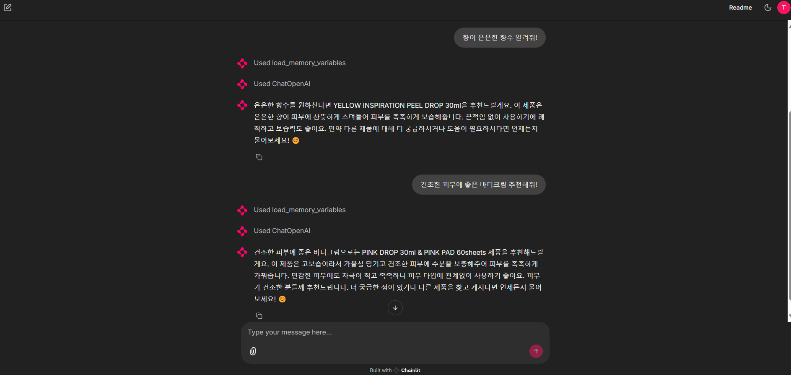

# SKN07-3rd-4Team

# 3차 프로젝트
 
# 1. 팀 소개
- 팀명: `너의 질문은?`
    <table>
    <tr>
        <th>신동익</th>
        <th>박민혁</th>
        <th>나성호</th>
        <!-- <th>송문택</th> -->
    </tr>
    <tr>
        <th style="vertical-align: top;">DB (Chroma)   RAG   API   UI</th>
        <th style="vertical-align: top;">DB (Milvus) 크롤링  임베딩   RAG   API   UI   발표</th>
        <th style="vertical-align: top;">DB (Milvus, Chroma)  크롤링  임베딩</th>
        <!-- <th>role 4.</th> -->
    </tr>
    </table>
 
# 2. 프로젝트 개요
- 프로젝트 명
    
    사용자 후기를 기억하는 QnA LLM 시스템 개발

- 프로젝트 소개

    소비자가 사용한 제품/서비스의 후기를 통해 신규 제공자/사용자가 궁금한 내용을 알려주는 LLM 서비스를 만들고자 한다. 주어진 블로그/웹 등 리뷰를 수집하고 LLM 모델이 주어진 리뷰의 날짜/별점/내용 등을 참조하여 시스템 사용자의 질의 응답을 준비한다.

- 프로젝트 필요성(배경)

    서비스가 장기적으로 운영되면서 사용자로부터 수집되는 데이터와 리뷰는 시간이 지남에 따라 방대해지고 복잡하다. 서비스가 성장하고 사용자 수가 증가함에 따라, 점점 더 많은 정보가 누적되고, 그에 따라 필요한 정보에 접근하는 것이 점차 어려진다. 그에 따라 사용자나 서비스 제공자가 필요한 정보만 알 수 있는 시스템의 필요성이 높아 개발하게 되었다.

- 프로젝트 목표

    사용자 특성에 맞게 필요한 정보만 빠르게 제공하는 시스템 (RAG: Retrieval-Augmented Generation model) 을 개발하고자 한다.
 
# 1. 기술 스택

 

 - 
 - 

## 주요 프로시저

- 프로젝트 수행 단계
    1. 크롤링으로 제품/서비스 데이터를 수집 (.csv)
    2. `./data/csv` 폴더안에 위치 시키고
    3. OpenAIEmbeddings 모델로 text를 임베딩 후 DB에 올리고
    4. ChatOpenAI, prompt, retriever 을 runnable로 설정
    5. chainlit 구축

- demo 시연 준비
    1. `./chainlit` 디렉토리에서 app.py 실행
    2. `localhost:8501` 접속
    3. 원하는 내용용 검색

## 수행결과(테스트/시연 페이지)

<table> 
  <tr><td align="center"><b>Demo 결과</b></td> </tr> <tr> <td>  </td> </tr> 
</table>
 
## 한 줄 회고
신동익:
박민혁:
나성호: